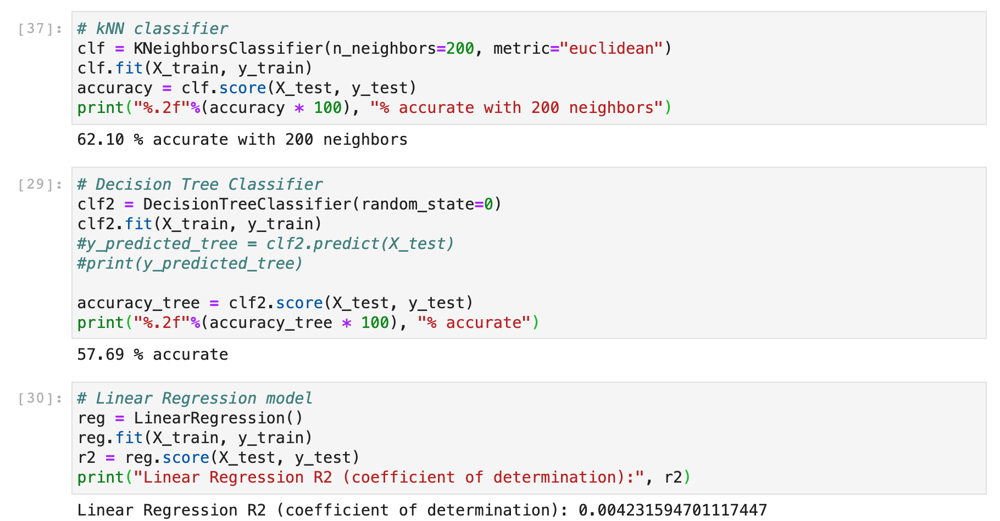

# Spotify Final Project CPSC 222 - Nelly Alger

All the functions used by the QuantifiedSelfProject.ipynb are located in utils.py and spotify_api.py, which are imported at the top so as long as as you run the import statements located at the very top, the code in the notebook should run fine.

The only issue with my project is that making requests to the Spotify API takes a long time with how many songs I'm fetching popularity data for, even though it's 2 months of data not the full year, so code cell 26 takes about 5 minutes to run on my machine, I'm not sure if it will be longer or shorter. I apologize for this inconvenience but it is the only way the classifiers will run. I would suggest either running my whole notebook then grading other people's while you wait, or I will insert images below of the classifier results from inserting the popularity column. There is also a csv file of what the data looks like before it is classified called "summer.csv".

